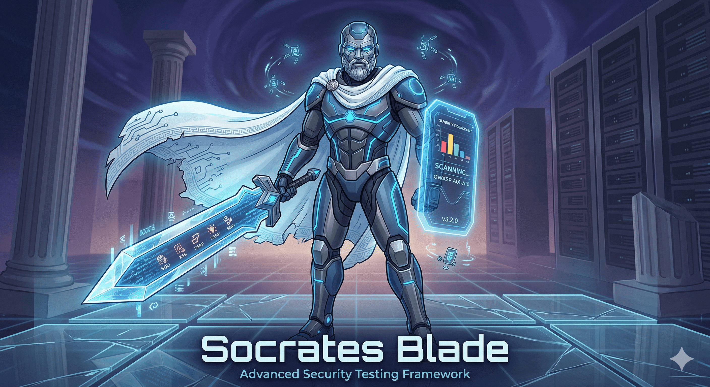

# Socrates Blade

**Security Testing Framework for Scriptlog PHP Blogware Applications**



[](https://github.com/scriptlog/socrates-blade/actions/workflows/ci.yml)


---

## What is Socrates Blade?

Socrates Blade is a security testing tool that helps you find vulnerabilities in Scriptlog PHP Blogware applications. It scans your web application for common security issues and provides detailed reports about what it finds.

Think of it like a health check for your website's security - it looks for weaknesses that hackers might exploit.

### What Can It Find?

- **SQL Injection** - Dangerous SQL commands that could steal your database
- **Cross-Site Scripting (XSS)** - Malicious scripts that could attack your users
- **Path Traversal** - Files that shouldn't be accessible
- **Server-Side Request Forgery (SSRF)** - Attacks that trick your server into visiting malicious URLs
- **And many more...**

---

## System Requirements

Before you begin, make sure your computer has:

| Requirement | Minimum Version | Why You Need It |
|-------------|-----------------|------------------|
| **Python** | 3.8 or higher | Runs the security scanner |
| **PHP** | 7.4 or higher | Extracts routes from your application |
| **curl** | Any recent version | Makes HTTP requests to test your site |
| **Operating System** | Linux, macOS, or Windows (with WSL) | The tool works best on Unix-like systems |

### Checking Your Python Version

```bash
python3 --version
```

### Checking Your PHP Version

```bash
php --version
```

---

## Installation

### Step 1: Download from GitHub

Open your terminal and run:

```bash
# Clone the repository
git clone https://github.com/scriptlog/socrates-blade.git

# Enter the directory
cd socrates-blade
```

### Step 2: Set Up Python Virtual Environment

```bash
# Create a virtual environment (keeps your Python packages organized)
python3 -m venv venv

# Activate the virtual environment
# On Linux/macOS:
source venv/bin/activate

# On Windows (Command Prompt):
venv\Scripts\activate.bat

# On Windows (PowerShell):
venv\Scripts\Activate.ps1
```

### Step 3: Install Dependencies

```bash
# Install required Python packages
pip install -r scanrequirements.txt
```

### Step 4: Verify Installation

```bash
# Check that everything is working
python3 socrates-blade.py --help
```

You should see a help message with all available options.

---

## Quick Start Guide

### Route Synchronization

Socrates Blade uses `export_routes.php` to dynamically extract route definitions from your Scriptlog/Blogware installation. This ensures the security scanner has up-to-date information about all available endpoints.

**Option 1: Place Socrates Blade Inside Scriptlog Installation**

For the best experience, place Socrates Blade inside your Scriptlog installation:

```bash
# Copy socrates-blade to your Scriptlog installation
cp -r socrates-blade /var/www/phpsite/public_html/

# Navigate to the tool directory
cd /var/www/phpsite/public_html/socrates-blade
```

When placed inside Scriptlog, `export_routes.php` will automatically detect the `config.php` in the parent directory and extract the correct application URL.

**Option 2: Standalone Installation**

Place Socrates Blade anywhere on your system:

```bash
# Copy lib folder from Scriptlog to socrates-blade directory
# (lib folder should be at the same level as export_routes.php)
cp -r /var/www/phpsite/public_html/lib /var/www/html/socrates-blade/

# Copy config.php to socrates-blade directory
cp /var/www/phpsite/public_html/config.php /var/www/html/socrates-blade/
```

### Generate Routes

After placing the tool, generate the routes.json file:

```bash
# Navigate to socrates-blade directory
cd /var/www/phpsite/public_html/socrates-blade  # if inside Scriptlog
# OR
cd /var/www/html/socrates-blade  # if standalone

# Export routes to JSON
php export_routes.php > routes.json
```

This will create an updated `routes.json` file with:
- Current timestamp
- Application URL from config.php
- All available routes from your Scriptlog installation

### Your First Security Scan

Let's run a simple scan on your local development server:

```bash
# Make sure your local server is running first!
# Then run the scan:

./run-scan.sh http://localhost
```

The tool will:
1. Validate that your URL is reachable
2. Check system requirements
3. Set up Python environment
4. Scan for vulnerabilities
5. Generate a report

### Running a Dry Run (Preview Mode)

If you want to see what the scan will do without actually running it:

```bash
./run-scan.sh http://localhost --dry-run
```

This shows you all the commands that would be executed - great for learning what happens behind the scenes!

---

## Common Usage Examples

### Basic Scan (No Authentication)

```bash
./run-scan.sh http://localhost
```

### Scan with Authentication

```bash
./run-scan.sh http://localhost \
    -u admin \
    -p your_password \
    -o findings.json
```

### Generate HTML Report

```bash
./run-scan.sh http://localhost \
    -u admin \
    -p your_password \
    --html-report report.html
```

### Aggressive Mode (Thorough Testing)

```bash
./run-scan.sh http://localhost \
    --aggressive \
    --timeout 30
```

Aggressive mode takes longer but tests more thoroughly.

### Scan Through a Proxy (e.g., Burp Suite)

```bash
./run-scan.sh http://localhost \
    --proxy http://127.0.0.1:8080
```

### Skip URL Validation

If your target isn't accessible but you still want to run the scan:

```bash
./run-scan.sh http://localhost --no-validate
```

---

## Understanding the Output

### Severity Levels

| Level | Meaning | Action Required |
|-------|---------|-----------------|
| **CRITICAL** | Immediate threat - could lead to data breach or complete system compromise | Fix within 24 hours |
| **HIGH** | Serious vulnerability that could be exploited | Fix within 7 days |
| **MEDIUM** | Moderate risk - should be addressed | Fix within 30 days |
| **LOW** | Minor issue - improve when possible | Fix within 90 days |

### Report Files

After a scan, you'll have:

- **JSON Report** (`-o report.json`) - Machine-readable format for automation
- **HTML Report** (`--html-report report.html`) - Easy to read in your browser

---

## Command-Line Options Reference

### Authentication
```
-u, --username <name>    Your username
-p, --password <pass>   Your password
```

### Scanning Options
```
--aggressive            Run more thorough tests (slower)
--brute-force           Test password guessing
--threads <n>           Number of parallel tests (default: 5)
--timeout <seconds>    How long to wait for responses (default: 5)
--proxy <url>           Use a proxy server
--wordlist <file>       Custom password list for brute force
```

### Reporting
```
-o, --output <file>      Save JSON report
--html-report <file>    Save HTML report
--report-dir <dir>      Where to save reports
```

### Other Options
```
--no-sync               Skip route synchronization
--no-validate          Skip URL validation
--dry-run              Show what would run without executing
-v, --verbose           Show detailed progress
-h, --help              Show this help message
```

---

## Testing the Scanner

### Run Unit Tests

```bash
# Run URL validator tests
./tests/bash/test_url_validator.sh

# Run BATS test suite
bats tests/bash/run-scan.sh.test.bats
```

---

## CI/CD Integration

### GitHub Actions

```yaml
name: Security Scan
on: [push, pull_request]

jobs:
  security-scan:
    runs-on: ubuntu-latest
    steps:
      - uses: actions/checkout@v4
      - name: Set up Python
        uses: actions/setup-python@v5
        with:
          python-version: '3.11'
      - name: Install dependencies
        run: pip install -r scanrequirements.txt
      - name: Run security scan
        run: |
          ./run-scan.sh ${{ secrets.TARGET_URL }} \
            -u ${{ secrets.TARGET_USER }} \
            -p ${{ secrets.TARGET_PASS }} \
            -o scan-results.json \
            --html-report scan-report.html
```

---

## Troubleshooting

### "Python not found" Error

Make sure Python 3 is installed:
```bash
python3 --version
```

### "curl not found" Error

Install curl or use an alternative method.

### "Permission denied" Error

Make the script executable:
```bash
chmod +x run-scan.sh
```

### Scan Fails to Connect

- Make sure your web server is running
- Try using `--no-validate` if the URL isn't reachable
- Check firewall settings

---

## Important Notes

### Only Test Systems You Own or Have Permission To Test

Using security tools on websites without permission is illegal. Make sure you:

- Have written permission from the system owner
- Are testing your own development environment
- Are following responsible disclosure practices

### Respect Rate Limits

Don't overwhelm target servers with too many requests. Use `--timeout` and `--threads` options responsibly.

---

## Getting Help

- Check the [Issues](https://github.com/scriptlog/socrates-blade/issues) page
- Review the code in `socrates-blade.py` and `config.py`
- Examine the payloads in the `payloads/` directory

---

## Project Structure

```
socrates-blade/
├── socrates-blade.py       # Main security scanner
├── run-scan.sh            # Automation wrapper (start here!)
├── config.py              # Configuration and settings
├── routes.json            # Application routes
├── export_routes.php      # PHP route extractor
├── scanrequirements.txt   # Python dependencies
├── payloads/              # Attack test payloads
│   ├── xss.txt           # XSS attack strings
│   ├── sqli.txt          # SQL injection strings
│   ├── traversal.txt     # Path traversal strings
│   └── ssrf.txt          # SSRF test strings
├── tests/                 # Test suite
│   ├── bash/             # Shell script tests
│   └── python/           # Python tests
├── LICENSE.md            # MIT License
└── README.md             # This file
```

---

## License

MIT License - See LICENSE.md file for details.

---

**Version**: 3.2.0  
**Last Updated**: April 2026  
**Maintained by**: Volunteer
